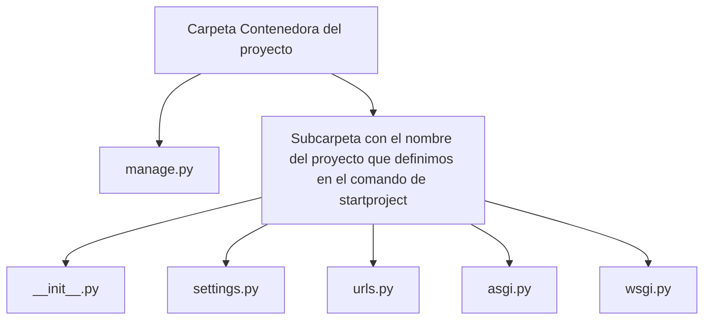

# 4 Archivos creados

cuando creamos un nuevo proyecto de django con el comando ```django-admin startproject {nombre_del_projecto}``` se crear varios archivos, estos archivos tiene diferentes funcionalidades o sirven para diferentes cosas, la estructura basica que se crea es la siguiente:




Esta es la estructura basica de nuestro projecto creado con django desde el principio

## Carpeta Contenedor del proyecto

Esta carpeta contenedora del proyecto o carpeta root/root directory es la contenedora del proyecto. su nombre no importa para Django, puedes renombrarla a algo que quieras.

## manage.py

El archivo manage.py es un command-line utility que te permite interactuar con este proyecto de Django de varias formas.

> **Note**
> puedes leeer todos los detalles acerga de manage.py en [django-admin & manage.py](https://docs.djangoproject.com/en/4.0/ref/django-admin/)

## Subcarpeta con el nombre del proyecto

Esta subcarpeta es el directorio real para el paquete de python de su proyecto.

Su nombre es el nombre del paquete de Python que deberá usar para importar cualquier cosa dentro de él. por ejemplo myproject.urls

## __init__.py

Un archivo vacío que le dice a Python que este directorio debe considerarse un paquete de Python.

> **Note**
> Si eres un poco nuevo con python o no sabes el porque de esto, puedes leer un poco mas acerca de los [paquetes o packages](https://docs.python.org/es/3/tutorial/modules.html#tut-packages) en python

## settings.py

Settings/configuration/configuracion para el proyecto de Django.

> **Note**
> Para mas informacion puedes buscar en [Django settings](https://docs.djangoproject.com/en/4.0/topics/settings/) para saber todo acerda de como trabajan las configuraciones en django. 

## urls.py

Este archivo es para las declaraciones de URL para este proyecto de Django, es una "tabla de contenido" de tu Django-powered site. 

> **Note**
> puedes obtener mas informacion de esto en [URL dispatcher](https://docs.djangoproject.com/en/4.0/topics/http/urls/)

## asgi.py

Es un entry-point o punto de entrada para ASGI-compatible web servers o servidores web compatibles con ASGI para servir a su proyecto.

> **Note**
> puedes ver mas detalles de esto en [How to deplay with ASGI](https://docs.djangoproject.com/en/4.0/howto/deployment/asgi/)

## wsgi.py

Es un entry-point o punto de entrada para WSGI-compatible web servers o servidores web compatibles con WSGI para servir a su proyecto.

> **Note**
> puedes ver mas detalles de esto en [How to deplay with WSGI](https://docs.djangoproject.com/en/4.0/howto/deployment/wsgi/)


