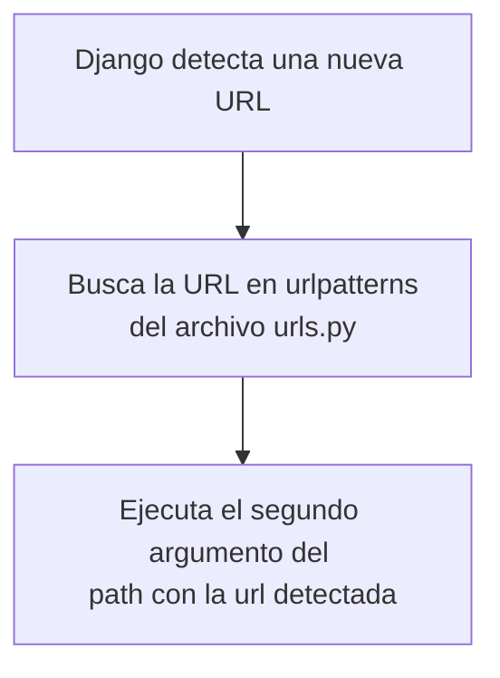

# Archivo urls.py

El archivo **urls.py** es un archivo que se crea por defecto al crear un proyecto de Django.

El codigo por defecto de este archivo es:

```python
from django.contrib import admin
from django.urls import path

urlpatterns = [
    path('admin/', admin.site.urls),
]
```

Lo que hace Django es que al ingresar una url, la busca directamente en este archivo **urls.py** expecificamente en la lista con el nombre **urlpatterns** y es aqui donde iremos poniendo nuestras urls de nuestra pagina.

Si queremos probar el funcionamiento de la misma podemos escribir un pequeño segmento de codigo como el siguiente en el mismo archivo:

```python
def pruebaUrls(self):
    print("\n\n\nHola mundo desde el archivo urls.py\n\n\n")
```

Posteriormente agregariamos un nuevo path a nuestra lista **urlpatterns** donde le pasariamos como primer argumento el nombre de lo que seria el controlador hablando en terminos de MVC (Modelo Vista Controlador) y como segundo argumento la funcion que realizara, en este caso la funcion **pruebaUrls**, entonces el path agregado tendria la siguiente sintaxis:

```python
path('{nombre controlador/}', {nombre funcion a ejecutar})
```

Por lo tanto nuestro archivo **urls.py** para esta prueba quedaria de la siguiente manera:

```python
from django.contrib import admin
from django.urls import path

def pruebaUrls(self):
    print("\n\n\nHola mundo desde el archivo urls.py\n\n\n")

urlpatterns = [
    path('admin/', admin.site.urls),
    path('prueba/', pruebaUrls)
]
```

Una vez hecho los cambios, ejecutamos nuestro proyecto en caso de no estar en ejecucion e ingresamos a la url que creamos, que si no hemos movido nada a la configuracion seria: **http://127.0.0.1:8000/prueba/**

Como este es un codigo muy burdo y mal hecho se generan varios errores pero si miramos nuestra terminal encontraremos algo similar a lo siguiente:


Lo que podemos observar es que a pesar de los errores, se ejecuto nuestra funcion y se puede apreciar lo que imprime nuestra funcion, esto nos ayuda a darnos una idea de como funciona django



> **Warning** Una vez hecha esta prueba debemos eliminar lo creado para eliminar los errores.