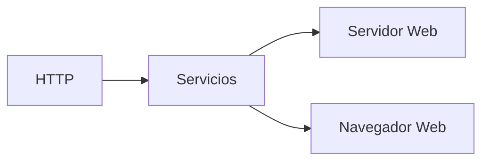
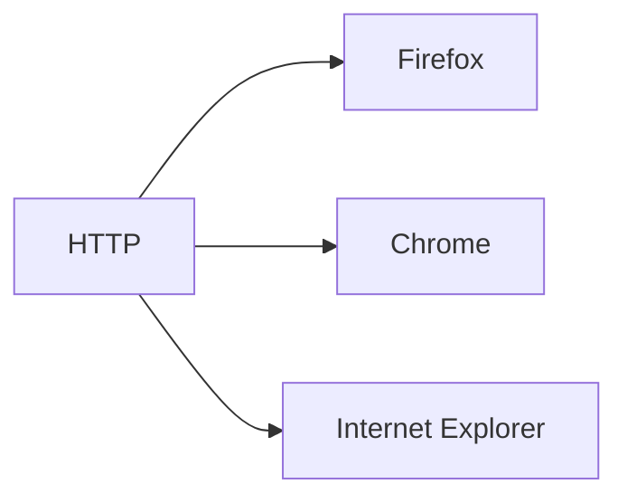
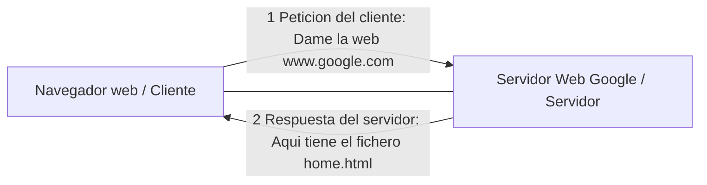
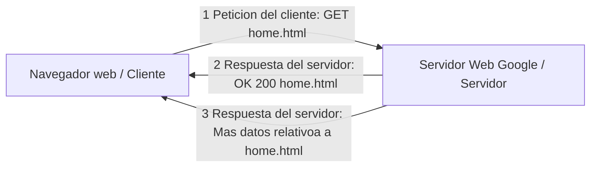
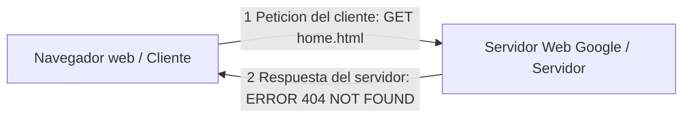

# Modelo TCP/IP: Introduccion a al Capa de Aplicacion

La capa de Aplicacion del modelo TCP/IP **tiene protocolos que proporcionan servicios a las Aplicaciones**, algunos ejemplos de estos protocolos son:

* HTTP
* POP3
* SMTP
* SSH
* FTP
* DNS

> **Warning**
> Esta Capa **NO DEFINE** la aplicacion en si, **SOLO SERVICIOS** que dichas aplicaciones necesitan.

La capa de Aplicacion no hace referencia a las aplicaciones como Google Chrome, FireFox, Opera, etc.

El modelo TCP/IP NO define el navegador en este caso, el modelo define los servicios que las aplicaciones utilizaran.

## Ejemplo: Aplicaiones Web

Las aplicaciones web utilizaran el protocolo HTTP, este protocolo lo que hace es definir algunos servicios que posteriormente utilizaran las aplicaciones.

Es este caso las aplicaciones seran los Servidores web y los Navegadores Web.

En otras palabras el mismo protocolo sera utilizado por diferentes aplicaciones.

Pero el modelo solo define eso, el protocolo, no las aplicaciones en si. La aplicacion debera adaptarce al protocolo, por lo tanto conseguimos Estandarización, lo que permite facilitarle la vida a los Programadores o desarrolladores.

## Arquitectura Cliente / Servidor 

La arquitectura Cliente/Servidor tambien se le conoce como Modelo cliente/servidor.

Esta arquitectura es la mas comun en la mayoria de las aplicaciones y lo que define esta arquitectura son dos roles:
* rol del cliente: el cliente es el usuario ser servicio.
* rol del servidor: el servidor es el que presta u ofrece el servicio al cliente.

### Ejemplo

Un cliente esta utilizando un navegador y hace una peticion a google, cuando le llegue esta peticion al servidor web, este buscara lo que el cliente le esta pidiento y respondera con el fichero que le ha pedido el cliente.

El cliente pide y el servidor Responde

## Capa de Aplicacion

De forma muy resumida el protocolo HTTP de la capa de Aplicacion define como se debe de establecer una comunicacion entre el cliente y el servidor.

El protocolo define el lenguaje y las posible peticiones y respuestas, veamos un ejemplo:

o en el caso de que no se encuentre lo de la peticion:

