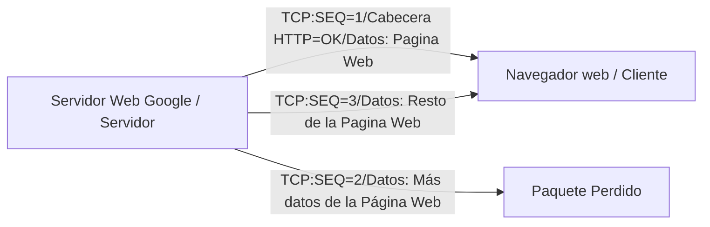
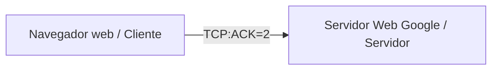
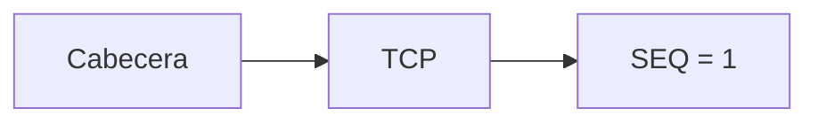

# Modelo TCP/IP: Introduccion a la capa de Transporte

En la capa de transporte nos vamos a encontrar principalmente con 2 protocolos, que son:

* TCP (Transmission Control Protocol)
* UDP (User Datagram Protocol)

Estos protocolos lo que hacen es proporcionar servicios a los protocolos de la capa de aplicacion, que es su capa superior, esto lo veremos con cada capa del medelo TCP/IP en donde cada capa proporciona servicios a su capa superior o a lo que esta encima de esta.

## ¿Qué tipo de servicios proporciona la capa de transporte?

Proporciona varios servicios como son:

* La recuperacion de Errores
* Control de Flujo
* La Multiplexación 

### La recuperacion de Errores

La recuperacion de errores de esta capa nos ayuda a recuperar paquetes perdidos, por ejemplo cuando el servidor realiza una respuesta a una peticion, esta respuesta puede estar dividida en varios paquetes, si se llegara a perder un paquete es donde entraria la recuperacion de errores.

Tengamos la siguiente comunicacion entre Cliente/Servidor donde el servidor esta enviando una respuesta al Cliente con un paquete perdido al Cliente

En este punto el Cliente se da cuenta que le falta un paquete ya que no se encuentra SEQ=2, es por eso que el Cliente le manda al Servidor un mensaje al servidor pidiendo el paquete con SEQ=2 con un cierto formato.

Entonces este servicio de recuperacion de Errores detecta los Errores y los corrige.

> los demas servicio se veran mas a detalle posteriormente

## Tipos de Interacciones

Hay diferentes tipos de Interacciones entre capas, en el caso del servicio de Recuperacion de Errores de la Capa de Transporte, interactua con la capa de Aplicacion por lo que tendriamos una **Interaccion a nivel de capas adyacentes**, tambien tenemos las **Interacciones a mismo nivel de capa** que serian las comunicaciones/interacciones que tiene las mismas capas, por ejemplo la capa de transporte de Google con la capa de transporte de un Cliente, aue es una comucicacion que se hace con las cabeceras.

En conclucion tenemos las interacciones:

* Interacciones a nivel de capas adyacentes
* Interacciones a mismo nivel de capa

> **Note** Esta interacciones se veran posteriormente

# Cabeceras

las cabeceras que agrega la capa de transporte seria la cabecera TCP

