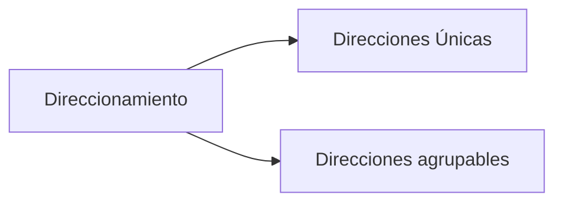
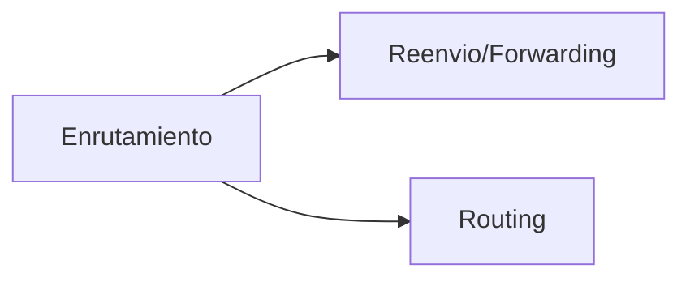
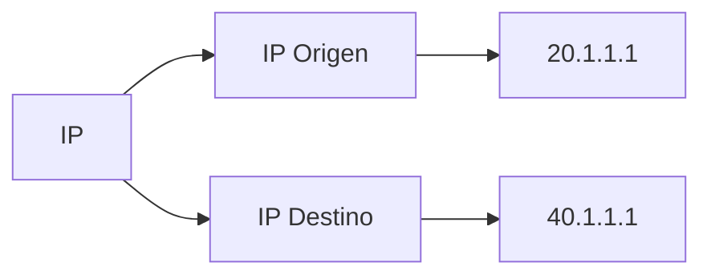

# Modelo TCP/IP: Introduccion a la capa de Red

En la capa de red tenemos principalmente un protocolo es cual es:
* IP (Internet Protocol)

Esta capa nos proporcionara principalmente los servicios de **direccionamiento** y de **enrutamiento**.

## Ejemplo

Para darnos una idea hasta el momento la capa de aplicacion y de transporte harian el papel de una persona que envia una carta utilizando el correo postal.

La capa de aplicacion seria la parte donde se escribe la carta ya que tiene que tener un formato, un tipo de lenguaje, entre otros.

La capa de transporte por ejemplo seria las fechas que se le ponen a la carta para saber que van en un orden es especifico o algun sello por parte del corro postal.

Por otro lado a partir de la capa de Red para abajo son las capas que entienden como funcionan las redes fisicas y las interconexiones entre nodos para entregar la informacion.

## Direccionamiento

En pocas palabras el Direccionamiento permite que cada equipo (concretamente cada interfaz de red) tenga una direccion unica.

Otro dato a Destacar es que estas direcciones son agrupables, en otras palabras que vamos a tener direcciones que forman parte de un mismo grupo de direcciones llamada red.

## Enrutamiento

El Enrutameinto hara referencia a la funcion que permite realizar los routers recibir la informacion que les llega por una interfaz de red y enviarla por otra interfaz distinta y tiene que decidir por cual enviarla para que llegue lo mas rapido posible.

La funcion de tomar la decicion de por donde enviar la informacion se llama **Routing** que la traduccion es enrutameinto.

La funcion de recibir y enviar un paquete de una interfaz se llama **Forwarding** que la traduccion es Reenvio.

## Como lo hara la capa de Red?

para que la capa de red pueda realizr sus funciones necesita direcciones, pero ¿Donde se ponen estas Direcciones?

Pues funcionan de la misma forma que las capas anteriores, **Se utiliza una cabecera** que es una parte de informacion que se pone en el paquete y en esta cabecera se  le ponen los datos que necesitamos, en este caso las direcciones IP principalmente

