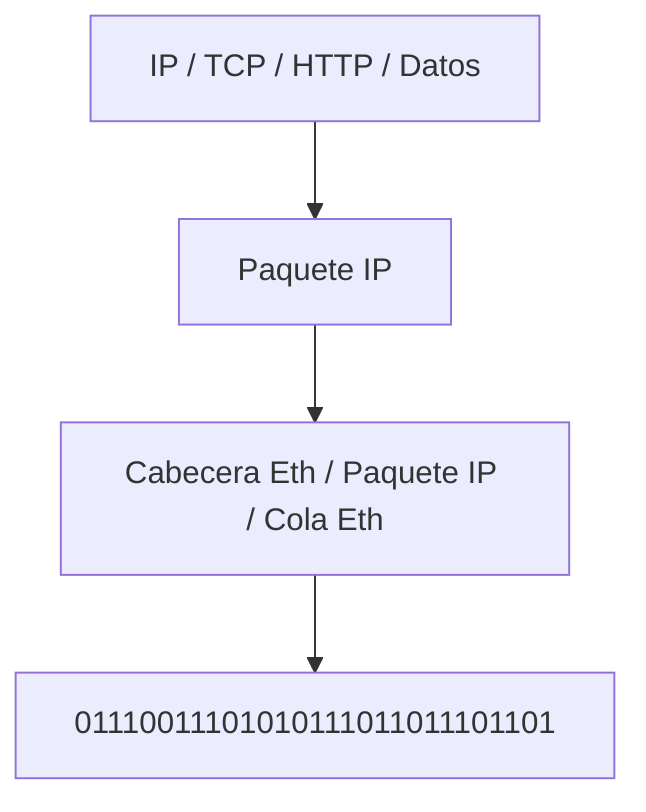

# Modelo TCP/IP: Introduccion a la capa de Enlace de Datos y a la Capa Fisica

De forma simplificada la capa de enclace de datos y la capa de fisica se encargan de la comunicacion mas a nivel de equipo y equipo que estan conectados entre si, no tanto a nivel de todo el trayecto que hace si no que a cada parte pequeña de este trayecto.

Como haran esta tarea? pues al igual que las otras capas, agregando una cabecera.

En este caso en particular al tratarce del protocolo Ethernet, no solamente se agrega una cabecera, si no que se agrega una cola, y luego pasa esta informacion a la capa inferior que es la capa fisica.

la capa fisica que funcion tiene? pues transmitir todos los 0's y 1's a la red, ya sea en forma de señal electrica, radio, etc.

## Capa Fisica

Se encarga de todas las funciones relacionadas con la transmission **fisica** en el medio, como el medio fisico

## Capa de enlace de datos 

Define protocoloes y normas de control de acceso y uso del medio, es decir como me pongo a enviar informacion a travez de la red.

Tenemos varios protocoloes, pero el mas utilizado es el ethernet, entre los protocolos tenemos:

* Ethernet
* PPP
* Grame Relay
* X.25
* ATM