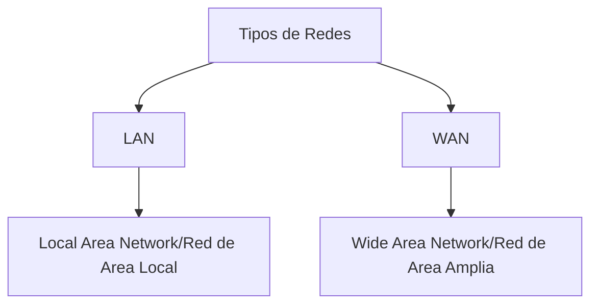
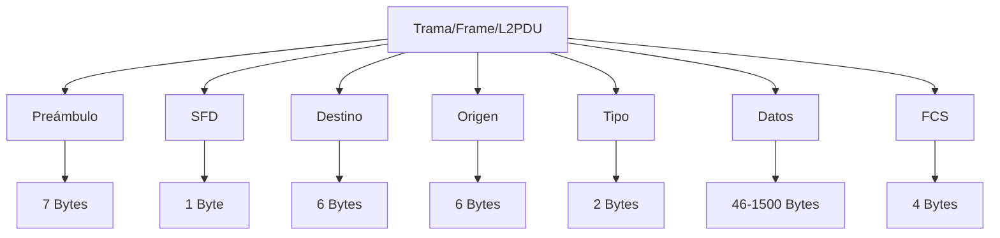

# Introduccion a las LAN Ethernet

En general se han definido 2 tipos de redes dependiendo de su tamaño, especificamente en su extencion, por ejemplo, una red puede extenderse por todo un edificio o incluso por todo un pais. 

Para diferenciar los diferentes tamaños de Redes se definieron 2 terminos.



Las Redes LAN abarcan el tamaño de lo que podria ser:
* Una casa.
* una Oficina.
* Un edificio.

Por otro lado las Redes WAN abarcan el tamaño de lo que podria ser:
* Regiones.
* Ciudades.
* Paises


> **Note**
> hay otros tipos de area como lo son el CAN (Campus Area Network) que esta en medio camino entre LAN y WAN.

## LAN

Las Redes LAN tiene 2 grandes Grupos:
* Las Redes **cableadas** que se basan en el **Protocolo Ethernet**.
* Las Redes **Inalambricas WLAN**.

Nos centraremos en Las redes Cableadas por el momento.

> **Note**
> Estas Redes Cableadas que se basan en el protocolo Ethernet se estandarizaron con el IEEE: **802.3**.

A pesar de que estamos en la capa 2, **Ethernet tambien define la capa 1**, Esto se debe a la **gran variedad de estandares para los cables** con el objetivo de enviar bits por un cable, aqui es donde entran los cables de cobre o la fibra optica.

Por otro lado en la capa 2, la capa de enlace de datos, solamente tenemos un estandar que es el  **Ethernet v2** o **Ethernet II**, lo que define Ethernet v2 es el formato del PDU, que en la capa 2 obtiene el nombre de Trama/Frame/L2PDU donde su objetibo es hacer llegar el Frame del origen al destino.

## Que se define en Ethernet v2?

Se define tanto la cabecera como la cola que permitiran hacer las funciones de esta capa.




De Preámbulo a Tipo es la Cabecera o Header y el FCS es la cola o Trailer.

---

### Envio y Recepcion de datos

Empezando por la funcion de Envio y Recepcion de datos, necesitamos una direccion, hasta el momento sabemos que tenemos una direccion IP de la capa 3 del modelo TCP/IP, pero a nivel de capa 2 tenemos otro tipo de Direcciones, las **Direcciones MAC**.

Estas direcciones las encontraremos en la cabecera de la Trama, especificamente en el Origen y en el Destino.

---

### ¿Como son las direcciones MAC?

Las direcciones MAC o Media Access Control, tienen un tamaño de 6 Bytes = 48 bits = 12 digitos hexadecimal.

Un ejemplo de Una direccion MAC es:

* 2C-33-7A-25-FF-C1

**Las direcciones MAC identifican una interfaz de Red** tambien llamas **NIC** (Network Card Interface).

> **Note**
> estas direcciones MAC de Interfaces de Red o NIC son UNICAS en el MUNDO.

Para que no se repitan las direcciones MAC el IEEE asigna a cada fabricante un identificador.

| Organizationally Unique Identifier/ OUI | Asignado por el fabricante|
| :-: | :-: |
| 24 bits | 24 bits |
| 6 digitos hex| 6 digitos hex |
| 2C-33-7A | 25-FF-C1 |

---

### Como visualizar las direcciones MAC?

Para visualizar las direcciones MAC de nuestros equipos podemos hacerlo con un sencillo comando dependiendo de si estamos en Windows o en Linu.

* Windows:

```bash
ipconfig /all
```

Con este comando podremos ver toda la configuracion de todas nuestras interfaces de red.

Podremos visualizar las direcciones MAC en el apartado de **Direccion fisica** para cada interfaz de red de neustro equipo o cada NIC.

* Linux

```bash
$ ifconfig 
```
Podremos ver las direcciones MAC en cada apartado de **ether**.

---

### Tipos de Direccions Adicionales

Tenemos diferentes tipos de direccion que son:

* Unicast
* Multicast
* Broadcast

```mermaid
    A-->B
    A-->C
    A-->D
    B-->E
    E-->EE
    C-->F
    D-->G

    A[Tipos de Direcciones]
    B[UNICAST]
    C[MULTICAST]
    D[BROADCAST]
    E[Se envia a un solo equipo]
    EE[Deben ser Unicas]
    F[Se envia a un grupo de Equipos de Red]
    G[Se envia a TODOS los equipos de la red]

```


