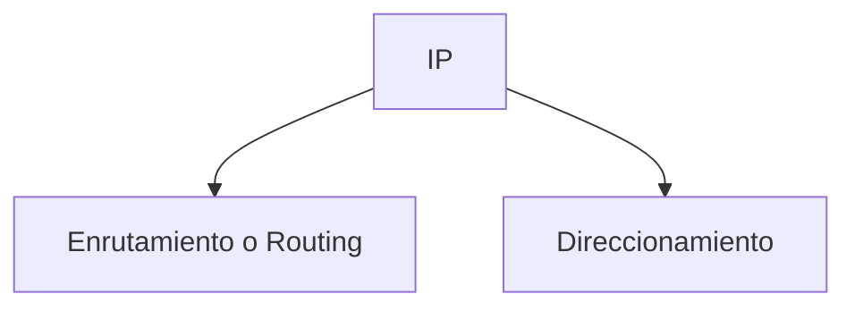

# Introduccion a la capa de Red y a los Routers

En la capa 3 o capa de Red tendremos Dispositivos como el Router y protocolos como OSPF, RIP, ICMP o el famoso protocolo **IP** que es el caracteristico de esta capa ya que se podria decir que es de los mas importantes.

El **Protocolo IP** es un protocolo de **capa 3** y como principales funcionamientos tenemos el **Direccionamiento y el Enrutamiento**.

El **Direccionamiento o Enrutamiento** son conceptos **similares** que tenemos en la **capa 2** donde el **direccionamiento** en lugar de ser con **Direcciones IP** tenemos las **Direcciones MAC** y en lugar de **Enrutamiento** tenemos el **Frame Forwarding** a pasar de que tenemos el **Forwarding o reenvio** junto al **Enrutamiento o Routing** no hay que confundirnos y pensar que son lo mismo.

> **Warning**
> El Enrutamiento o Routing y el Reenvio o (Forwarding) NO SON LO MISMO

## Red en Capa 3

En esta capa, la palabra **Red** puede tener 2 significados distintos, puede ser Red como conjuntos de equipos interconectados y Red como Red IP que seria una agrupacion de Direcciones IP.

Tomara un significado u otro dependiendo del contexto

## Cabecera IP - Internet Protocol

Cuando tenemos este protocolo, la informacion del protocolo IP se agrega de forma de cabecera en el paquete (Trama en la capa 2, paquete en la capa 3).

Esta cabecera tiene varios datos almacenados como son:
* Version
* IHL
* Tipo de servicio
* Logitud total
* Identificador
* Flags
* Fragment offset
* Tiempo de vida (TTL)
* Protocolo
* Checksum de la cabecera
* Direccion Origen
* Direccion destino
* Opciones + Relleno

Pero por lo mientras solamente nos vamos a enfocar en los que nos interesan que son **Direccion Origen y Destino** ya que seran estos 2 campos los que utilizaran los Routers para realizar su funcion de Enrutamiento.
