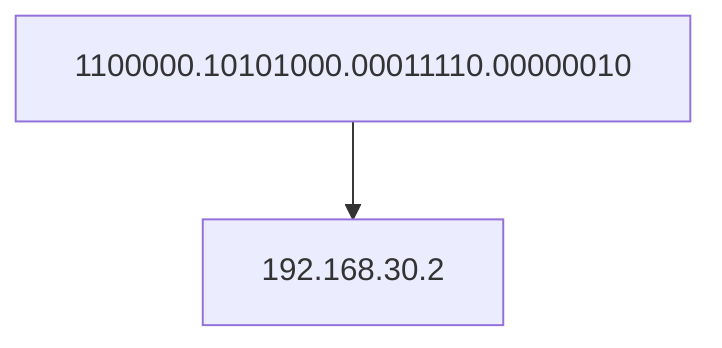
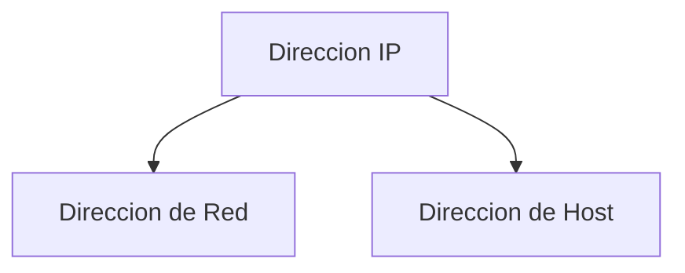

# Direccion IP y Mascara de Red

El protocolo IP tiene 2 veriones el Protocolo IPv4 y el IPv6.

En esta introduccion a las redes veremos unicamente el IPv4, aunque hay que mencionar que el IPv6 se crea para solucionar la falta de abastecimiento del IPv4 por falta de direcciones IP, pero para centrarnos en los fundamentos de las redes y para el entendimiento de la capa 3 es mas que suficiente con IPv4.

## IPv4

En IPv4 las direcciones generalmente nos sirven para identificar una interfaz de red.

> **Warning** Una IP != Un equipo.

Un equipo puede tener varias interfaces de red, de hecho es muy habitual en servidores y cada interfaz tendra su direccion IP.

Es posible que una interfaz de red pueda tener varias direcciones IP y lo vamos a encontrar por ejemplos en entornos de virtualizacion, donde un equipo fisico internamente tiene varios equipos independientes entre si.

**Por lo tanto** un equipo puede tener varias interfaces de red y una interfaz de red puede tener varias direcciones IP.

## Direccion IP

Una direcciones IP esta formada por 32 bits, estos 32 bits estan agrupados en 4 octetos y separamos los octetos mediante puntos ".".

> **Note** Como estamos hablando de agrupaciones de 8 bits tenemos que tener en cuenta que un octeto no podra tener valores mayores de 255, solamente podra tener valores entre 0-255.

### Partes de una direccion IP

Las direcciones IP esta formado por 2 partes:
* Direccion de Red: que hace referencia a la Red IP o a la agrupacion de direcciones IP.
* Direccion de Host: que hace referencia al host, al dispositivo final.

Estas dos partes es habitual llamarlas **porcion de red y porcion de host**.

¿Que octetos pertenecen a la porcion de red y cuales a la poricon de host?

Pues esto puede varias, pero va a venir definido por otro elemento llamado **Mascara de Red**.

## Mascara de red

Una Mascara de red o Netmask, es un indicador que define **cuantos bits** de una IP son de Host y cuantos son de Red.

La mascara de red esta formada por 32 bits, separados en 4 octetos, igual que la direccion IP y esta separada por puntos.

### Ejemplo

Tengamos la siguiente direccion IP:

11000000.10101000.00000000.00011001
192.168.0.25

Una posible Netmask seria:

11111111.00000000.00000000.00000000
255.0.0.0

Para saber que bits pertenecen a la porcion de host y de red tenemos que fijarnos en las formas binarias de la direccion IP y de la mascara de red.

IP: 11000000.10101000.00000000.00011001
NM: 11111111.00000000.00000000.00000000

Cada 1 de la Netmask nos dice que el mismo bit pero de la Direccion IP pertenece a la porcion de Red.

Cada 0 de la Netmask nos dice que el mismo bit pero de la Direccion IP pertenece a la porcion de Host.

Por lo tanto en este caso, el primer octeto de la direccion IP pertenece a la porcion de Red mientras que los ultimos 3 octetos pertenecen a la porcion de Host.

### Resumen y Nota Importante

En resumen para realizar una mascara de red o Netmask tenemos que contar cuentos bits de la direccion IP pertenecen a la porcion de red y pondremos esos bits en la mascara de red con valor 1 y los bits de host con valor 0.

Siempre pondremos o veremos los 1's a la izquierda y los 0's a la derecha, nunca los vamos a ver intercalados.

## Notaciones de la mascara de Red.

Hasta ahora hemos visto que tanto la direccion IP y la mascara de red tienen 2 diferentes notaciones que son:

* Decimal: 255.255.255.0
* Binario: 11111111.11111111.11111111.00000000

Tambien tenemos la notacion:

* Prefijo/CIDR: /24

Ejemplo:

192.168.1.1/24 

que es lo mismo que:

IP --> 192.168.1.1
Netmask --> 255.255.255.0

ya que el numero que sigue de la diagonal indica cuantos bits pertenecen a la porcion de Red.
