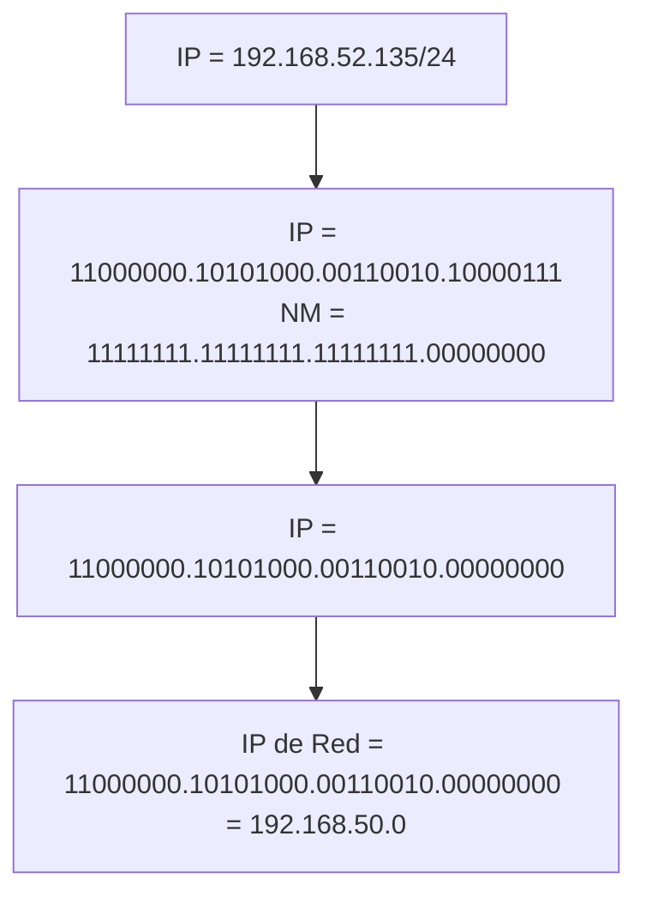
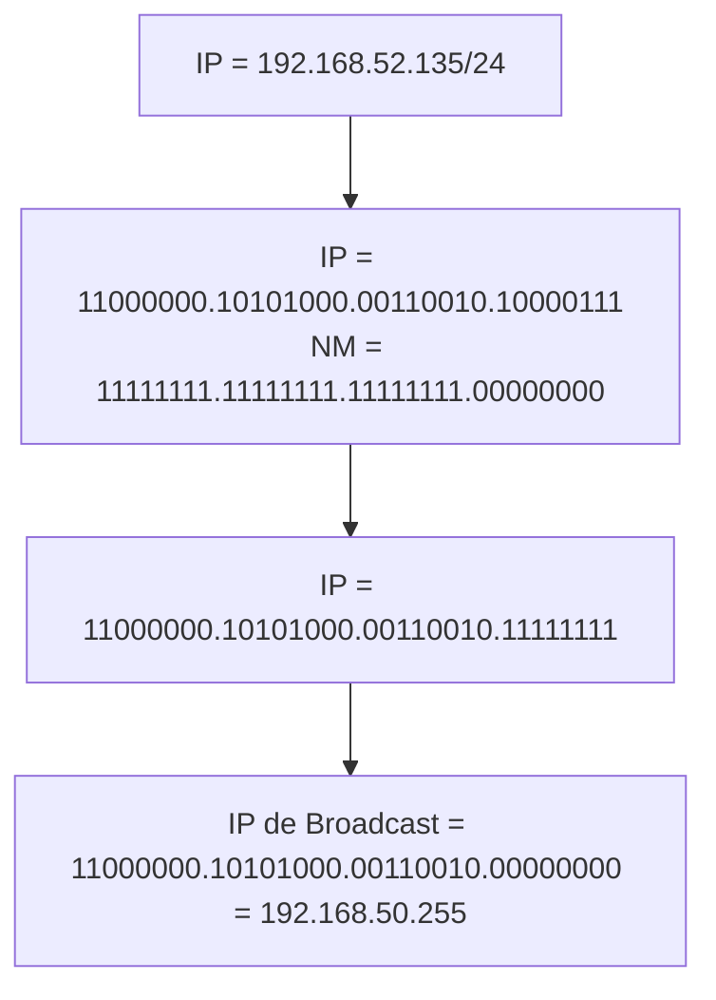

# Calcular direcciones IP de red, Host y Broadcast

Una Red IP es una agrupacion de Direcciones IP, pero no solamente es una agrupacion al azar, es un Rango de direcciones IP, es decir, un conjunto de direcciones Seguidas.

Dentro de una Red o Red IP encontraremos:
* IP de Red
* IPs de Host
* IP de Broadcast

## IP de Red

La IP de Red siempre sera la primera direccion IP del rango.

IP de Red tambien se le conoce como ID de red o Network ID y esta direccion no se puede asignar nunca a un dispositivo o interfaz, esta direccion es utilizada por los Routers para realizar el Routing y poder calcular en que red se encuentran las direcciones IP que tiene que enrutar.

## IP de Broadcast 

La IP de Broadcast es la ultima del Rango y esta direccion tampoco se puede asignar a ninguna interfaz y se utiliza para aquellos casos en los que queremos enviar algo a todos los equipos de esa red.

> **Note** La Direccion MAC de Broadcast de capa 2 siempre es ffff.ffff.ffff, pero en este caso con las direcciones IP es distinto porque cada Red va a tener su propia direccion IP de broadcast.

## IPs de Host

Las IPs de Host van a ser todas aquellas direcciones IP que se encuentren en medio de la IP de Red y la IP de Broadcast.

## Forma de Calcular las diferentes IPs de una Red 
Para realizar los calculos supongamos que nos dan la siguiente IP:

* 192.168.52.135/24

---

### IP de Red 

IP de red es el ID o Identificador de Red.

Tenemos que poner todos los bits de host de la direccion IP a 0.

---

### IP de Broadcast 

IP de Broadcast es la direccion usada para enviar informacion a todos los host de la red.

Tenemos que poner todos los bits de host de la direccion IP a 1.

---

### IPs de Host

Las IPs de Host son las direcciones que se asignan a cada equipo/interfaz.

Estas se obtienen con todas las combinacones de los bits de host que no sean IP de Red o IP de Broadcast.

Usando los ejemplos anteriores, los IPs de Host irian desde 192.168.50.1 - 192.168.50.254.

## Ejemplo Extra de calcular las IPs de una Red 

Para realizar los calculos supongamos que nos dan la siguiente IP:

* 172.16.5.11/16

Con dicha IP sabemos que la porcion de Host serian los ultimos 2 octetos de la IP por lo tanto sabemos lo siguiente:

* IP de Red = 172.16.0.0
* IP de Broadcast = 172.16.255.255

Y por ultimo las IPs de Host seran todas las direcciones que estan entre la IP de Red y la IP de Broadcast por lo tanto serian:

* 172.16.0.1 - 172.16.0.255, 172.16.1.0 - 172.16.255.254.

Por lo tanto habia 65023 IPs de Host disponibles.
