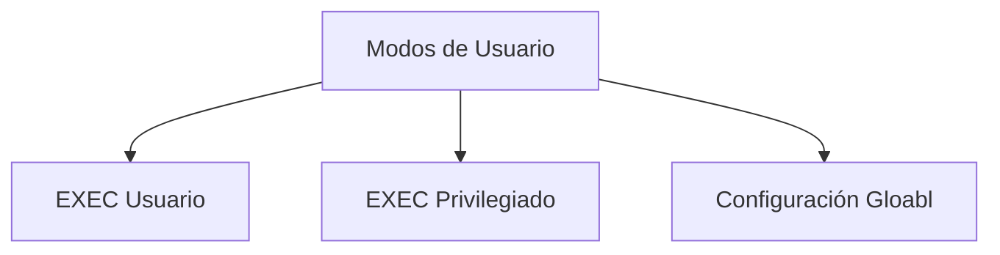
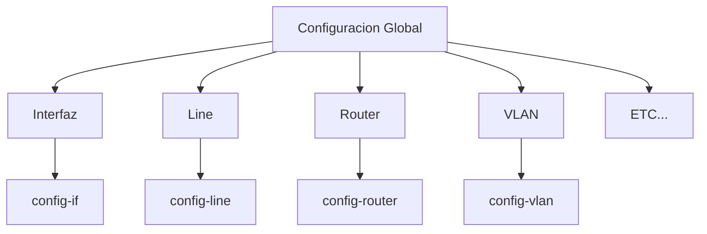
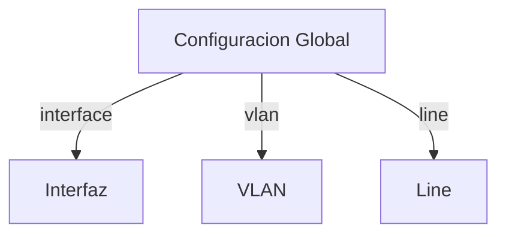

# Modos de usuario de la CLI

Una vez que entramos al CLI del equipo hay varios modos de usuario



Cuando nos conectamos al CLI del equipo empezamos en el modo de EXEC Usuario, y desde este modo podemos pasar al modo EXEC Privilegiado y de este podemos pasar al modo de Configuracion Global.

Lo que no podemos hacer es pasar de EXEC Usuario directamente al modo de Configuracion Global.

## EXEC Usuario

Este es el modo en el que entremos directamente al conectarnos al equipo.

Desde este Modo podemos hacer las siguientes cosas:

* Permite consultar informacion sobre el estado del equipo
* Cierta informacion no es accesible
* No permite modificaciones
* Comandos muy limitados

Podemos imginarlo como un modo de SOLO lectura restringido.

Sabemos que estamos en este metodo cuento el **PROMPT sea ">"**

> prompt es el caracter o conjunto de caracteres que se muestran en una linea de comandos para indicar que esta a la espera de ordenes.


## EXEC Privilegiado

Tenemos que ingresar a este modo desde el modo EXEC Usuario.

* Se accede mediante el comando ```enable```desde el modo de usuario o EXEC Usuario
* Normalmente requiere contraseña de acceso (Es opcional pero muy recomendable)

Sabemos que estamos en este metodo cuento el **PROMPT sea "#"**

## Configuracion Global

Tenemos que ingresar a este modo desde el modo EXEC Privilegiado.


Sabemos que estamos en este metodo cuento el **PROMPT sea "(config)#"**


* Se accede mediante el comando ```configure terminal``` desde el modo Exec Privilegiado.
* No requiere contraseña porque ya estabamos en modo Privilegiado
* Permite ejecutar comandos de configuracion
* Organiza los comandos en SUB-MODOS



* Interfaz: configurar caracteristicas propias de las interfaces
* Line: Configurar cosas como los accesos por telnet, ssh o por consola, como lo son las password, equipos permitidos, etc.
* Router: Configurar la parte especifica de los Protocolos de enrutamiento
* VLAN: Configurar las Virtual LANs

Para ingresar a estos modos tendremos que utilizar una palabra cable seguido de un identificador, por ejemplo:

```bash
Switch(config)# interface gigabitEthernet 0/1
```

De forma similar lo haremos para cada sub-modo.




## Regresar al modo anterior

para regresar al modo anterior tenemos varias formas.

Tenemos los comandos:
* end
* exit

y el comando:
* ```CTRL``` + ```z```

