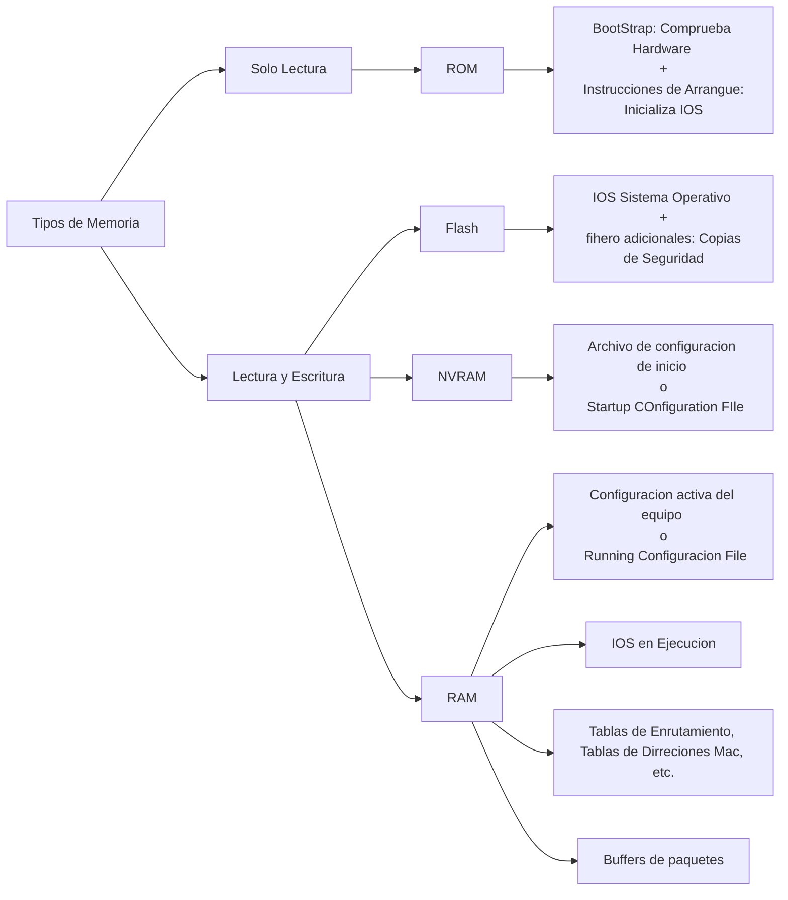

# Tipos de memoria, secuencia de arranque y ficheros de configuracion.

Tanto los Switches como los Routers de por lo menos Cisco tienen una estructura parecida a la de un ordenador ya que constan de las siguientes partes:

* CPU: En pocas palabras es el cerebro del equipo.
    * Ejecuta las instrucciones del sisteme operativo.
    * Inicializar el sistema
    * Funciones de enrutamiento.
    * Control de las interfaces de red.
* Memorias: Es donde se almacenan los datos ya sean temporales o permanentes.
    * RAM
    * ROM
    * NVRAM
    * FLASH
* Interfaces: Entradas y Salidas para Recibir y Enviar Datos.
* Buses: Son los canales de comunicacion de los anteriores elementos.

## Memorias

Las memorias son una parte muy importante de estos equipos es por esto que vamos a ver un poco mas a detalle los diferentes tipos de memorias.

### ROM

ROM (Read Only Memory o Memoria de solo lectura), como su mismo nombre lo indica esta memoria solamente se puede leer, no se puede modificar el contenido.

Su contenido viene grabado de fabrica y se mantendra asi a lo largo del equipo, la unica forma de realizar un cambio o un Upgrade es necesario quitar el chip y poner uno nuevo.

Lo que contiene esta memoria es el **BootStrap** que es un pequeño programa que se encarga de iniciar el equipo, hace comprobaciones de Hardware y a continuacion se encarga de buscar el Sistema Operativo en la memoria Flash y cargarlo en la RAM.

### Flash

Es una memoria de Lectura y Escritura.

La memoria Flash en concreto contiene el IOS (Sistema operativo) por lo tanto no es una memoria que estaremos reescribiendo a menudo ya que solamente lo reescribiremos cuando queramos hacer un Upgrade del IOS.

Tambien es posible guardar copias de Seguridad.

### NVRAM

Esta memoria es de Lectura y Escritura.

Esta memoria contiene el Archivo de configuracion de inicio o **Starting Configuration File**, esta configuracion es aquella que esta guardada en el equipo y es la que se cargara cada vez que apagamos y prendemos el equipo.

Su nombre proviene de **Non Volatile RAM** o **Memoria RAM no Volatil**, porque lo bueno de esta memoria es que se mantiene igual al apagar el equipo por lo que no se pierden los datos.

### RAM

Esta memoria es de Lectura y Escritura.

Esta memoria es aquella que tiene la configuracion activa del equipo que se llama **Running Configuration File** 

> **Note** La diferencia entre la Running Cofiguration File y la Starting Configuracion File es que al realizar un cambio en un equipo como lo es el cambio de nombre del Hostname de un Switch como lo hicimos en los Ejercicios Practicos es que estos cambios se guardan en la memoria RAM porque todos los cambios que se realizan siempre se hacen en la memoria RAM, para que estos cambios no se pierdan al reiniciar el equipo es necesario guardarlos reescribiendolos en la memoria NVRAM.

En la memoria RAM tambien se guarda la imagen del sistema operativo o IOS en ejecucion, tambien se guardan las tables de Enrutamiento, tablas de direcciones MAC, etc.

Tambien se guardan los paquetes en espera en lo que se llama **packet Buffers** o Buffers de paquetes

## Resumen de las memorias

