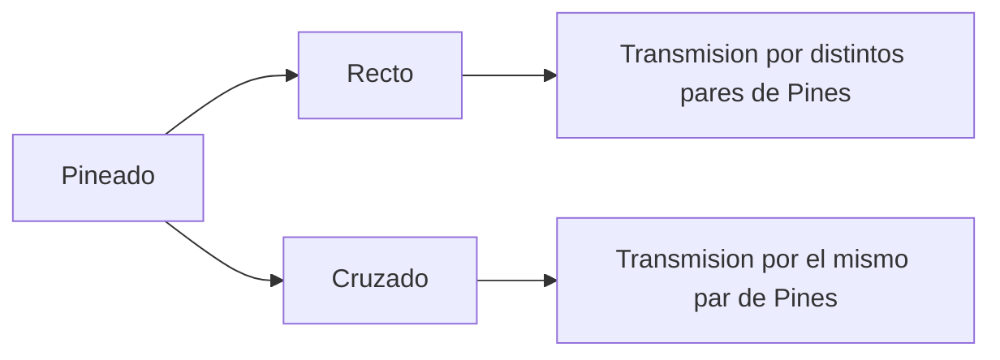

# Cableado UTP: Recto y Cruzado

Para saber en que casos se utiliza cable UTP Recto y Cruzado, se realizara al mismo tiempo una practica en PacketTracer. Aunque en pocas palabras, el cable UTP Recto se utiliza para interconectar equipos de diferente capa y el cable UTP Cruzado para interconectar equipos de la misma capas.

> **Warning** Cable recto para equipos de diferentes capas y cable cruzado para equipos de la misma capa no es un regla general que siempre funciona para todo, a pesar de que es general funciona para muchos equipos nunca hay que confiarnos.

## Teoría de cables de Red.

Si recordamos bien, Ethernet es el protocolo de capa 2 que mas se utiliza, pero tambien es un protocolo de capa 1,  ya que en la capa 1 Ethernet define los estandares de los diferentes tipos de cables los cuales pueden ser de cobre o de fibra optica.

Los tipos de clabes que mas encontraremos en Redes seran:
* Fast Ethernet con velociada de 100Mbps y longitud MAX 100m.
* Gigabit Ethernet con velocidad de 1000Mbps y longitud MAX de 100m.
* 10G Ethernet con velocidad de 10Gbps y longitud MAX de 100m.

Los anteriores Estantares usan clables de tipo UTP (Unshield Twisted Pair o Par trenzado no-blindado) y siempre que sean cables UTP seran de cobre.

> **Note** Con el cableado de cobre enviamos la informacion con señales electricas creando antes un circuito y para ello necesitamos 2 cables.

Los cables UTP son cables que tienen cables mas chicos dentro de este, y estan trenzados entre si en pares.

En los cables UTP encontraremos cables con 2 pares de cables (10BASE-T y 100BASE-T) y con 4 pares de cables (1000BASE-T).

> **Note** Los cables van trenzados porque un circuito electrico genera un campo electromagnetico y en cada uno de estos pares se va a crear un circuito electrico por lo que se va a crear un campo electromagnetico, y este campo electromagnetico puede llegar a afectar generando interferencias a los otros pares de cables y a esta interferencia se le conoce como Crosstalk, pero se descubrio que al trenzar los pares de cable entre si se reducia la interferencia entre pares de cables distintos y es por eso que los pares de cables van trenzados en los cables UTP, para disminuir la interferencia entre si.

Los cables UTP utilizan el conector RJ-45.

## Cable Straight-Through y Cross-Over (Recto y Cruzado)

Para saber que tipo de cable utilizar para conectar equipos, necesitamos saber cuales son las diferencias entre si y en pocas palabras la diferencia es el tipo de pineado.

En los cables Rectos si un cable esta conectado en el pin 1 de un RJ-45 tendra que esta conectado en el pin 1 del otro conector RJ-45.

Pineado:
* 1 -> 1
* 2 -> 2
* 3 -> 3
* 6 -> 6

En los cables Cruzados cambia el pineado

Pineado:
* 1 -> 3
* 2 -> 6
* 3 -> 1
* 6 -> 2

otra forma de verlo mas facil es:
* 1 Y 2 <--> 3 Y 6
* 3 Y 6 <--> 1 Y 2

El porque un cable va conectado de un pin no en otro es cosa de los protocolos y estandares. 

## ¿Por que hay cables Cruzados y Rectos?

Para que exista comunicacion entre equipos tiene que haber tanto transmision y recepcion, y para una correcta transmision, los cables tienen que ir conectados a las posiciones correctas del pineado.

Si transmitimos informacion por un equipo el otro equipo lo tiene que receptar.

Por ejemplo en los NIC o tarjetas de red de los equipos finales como los ordenadores tienen su transmision en los pines 1 y 2, y a su vez tiene la recepcion en los pines 3 y 6, Esto lo cumplen todas las NICs con estandar Ethernet.

Por otro lado los Switch siempre tienen los pines 1 y 2 para la repection y los pines 3 y 6 para la transmision.

Por lo tanto para interconectar un ordenador y un switch hay que tener en cuenta que la transmision de un ordenador esta en los pines 1 y 2 mientras que el switch tiene la recepcion por los pines 1 y 2, por lo tanto el cable que vamos a necesitar para interconectarlos sera un cable recto para conectar adecuadamente la transmision con la recepcion.

Si intentamos conectar 2 Switches hay que usar un cable cruzado para poder conectar los pines 1 y 2 para la recepcion de un switch con los pines 3 y 6 de transmision del otro switch.

> **Note** Un router transmite y recepta igual que un ordenador 

## Resumen

Con todo lo anterior podemos concluir de forma rapida lo siguiente:

Los equipos que transmiten por pines 1 y 2:

* PC
* Server
* Router
* Firewall
* Access Point

y estos equipos se le conocen como MDI (Medium Dependent Interface)

Los equipos que transmiten por pines 3 y 6:

* Switch
* HUB

y estos equipos se le conocen como MDI-X (Medium Dependent Interface Crossover)