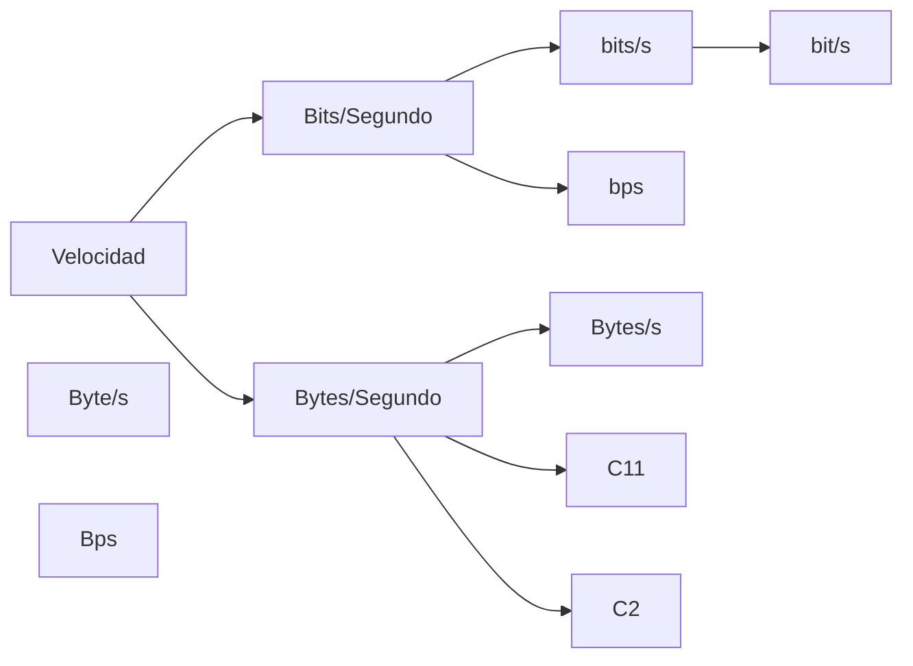
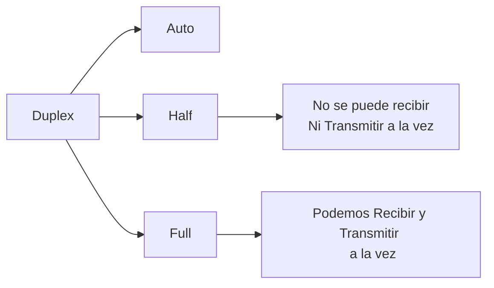
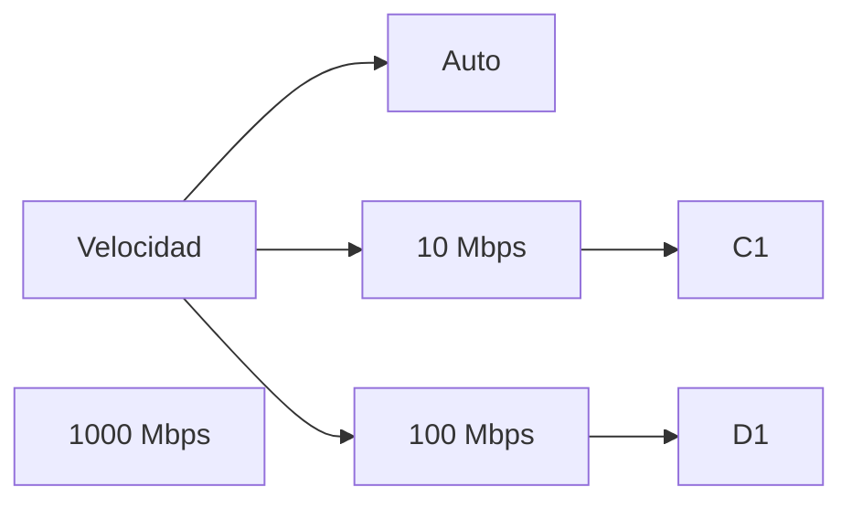

# Ancho de banda, Delay, Puerto e Interface y Autonegociacion del half/full Duplex.

En este punto es necesario incorporar nuevos terminos como es el Ancho de banda o el Delay.

> **Note** al **ancho de banda** en ingles se le conoce como **Bandwidth** y a la **latencia** como **Delay**.

## Ancho de banda

Desde un punto de vista informatico, computacional o de Redes informaticas, el Ancho de banda se refiere a la velocidad maxima de transferencia de datos a travez de un enlace o de una ruta, tambien podriamos decir que es la capacidad maxima de velocidad de envio y recepcion de datos.

El ancho de banda Normalmente se mide en Bits/Segundo, por ejemplo:

* 10 bits/s
* 2 kbit/s
* 1 Mbps
* 10 Gbps
* 10 Gbits/s

Aunque tambien podemos encontrar una medida de Ancho de banda que sea con Bytes/Segundo.

* 1 Mbyte/s

> **Note** 1 Byte == 8 Bits



> **Warning** Es importante ver adecuadamente ya que no es lo mismo Bps que bps, y esto puede generar errores.

## Ancho de banda soportados por los Switches

En los Switches actuales tiene las siguientes velocidades y podremos identificarlos con los siguientes nombres:
| velocidad | Nombre | Ejemplo de visualizacion |
| :-: | :-: | :-: |
| 10 Mbit/s | Ethernet | Eth 0/0 |
| 100 Mbit/s| FastEthernet | Fa 0/0 |
| 1 Gbit/s | GigabitEthernet | Gi 0/0 |
| 10 Gbit/s | TenGigabitEthernet | Te 0/0 |

## Latencia o Delay

La latencia o Delay es el tiempo que tarda en llegar la informacion y se suele medir en milisegundos (ms) y dependiendo del medio de transmision nos estaremos moviendo en unos valores o en otros.

por lo tanto podemos decir que mientras mas latencia peor.

## Puerto e Interface 

El puerto e Interface muchas veces se le hace referencia como si fueran lo mismo a pesar de que no es asi, aunque estan muy relacionados entre si.

La Interface es la representacion "Software" del Puerto Fisico, en otras palabras hace referencia al puerto fisico que tenemos en un Switch por ejemplo.

Una Interface es donde configuramos lo que queremos que se aplique a ese puerto fisico.

En pocas palabras el Puerto es lo Fisico mientras que la Interface es lo Logico.

## Interfaces Duplex y velocidad

En las Interfaces tambien definiremos si trabaja de forma Dulex y su velocidad.

---

### Duplex

Respecto a Duplex tenemos 3 opciones de configuracion:



Para realizar esta configuracion lo realizaremos desde el Submodo de interfaz del modo de Configuracion Global con el siguiente comando:

```cli
Switch(config-if)#duplex {modo}
```

---

### Velocidad

En cuanto a le velocidad, dependiendo del modelo y de la interfaz en cuestion tendremos unas opciones u otras, algunas de las opciones que podremos encontrar seran:



Para realizar esta configuracion lo realizaremos desde el Submodo de interfaz del modo de Configuracion Global con el siguiente comando:

```cli
Switch(config-if)#speed {velocidad}
```

> **Note** Un comando para ver estos temas es el comando ```show interface status```, este comando lo ejecutaremos desde el modo privilegiado. Este comando tiene sus variebles donde le puedes agregar mas argumentos para tener resultados mas especificos

## Autonegociacion

Cuando tenemos configurados el ancho de banda y la velocidad como **auto**, lo que realizaran los equipos es una autonegociacion entre ellos para funcionar adecuadamente.

Para el ancho de banda lo que hacen los equipos es que establecen la velocidad con los valores maximos comunes en ambos equipos.

Para el Duplex pasa algo similar, si ambos equipos soportan Full Duplex, se establece esta, pero si un equipo solamente soporta Half Duplex de establecera esta.

> **Note** los Switches soportan tando Full como Half Duplex.

Lo recomendado seria no depender de la autonegociacion porque puede generar problemas de rendimiento ya que Duplex utiliza la normativa IEEE donde:
* si la velocidad es 10 o 100 -> Half Duplex
* si es superior -> Full Duplex

Esto puede generar Rendimientos muy bajos por errores de configuracion con la autonegociacion.