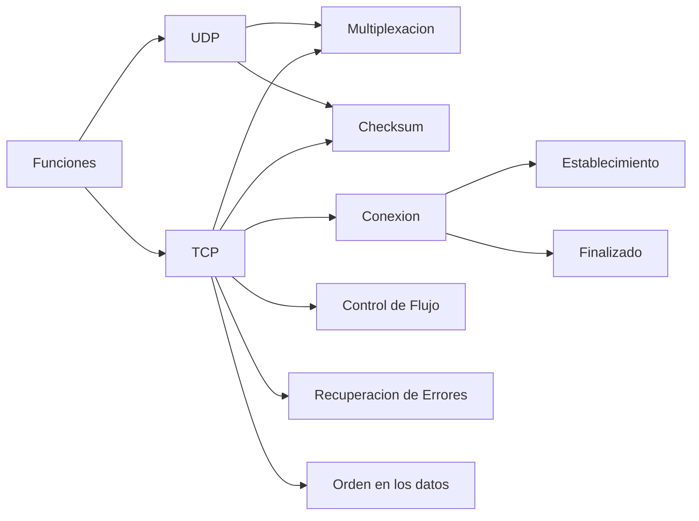

# Funciones de los protocolos TCP y UDP - Multiplexacion

Como hemos visto anteriormente el protocolo mas importante de la capa 2 es el Ethernet y el mas importante en la capa 3 es el IP.

En la capa 4 hay 2 protocolos muy importante que son:

- **El protocolo TCP (Transmission Control Protocol).**
- **El protocolo UDP (User Datagram Protocol).**

Estos protocolos **proporcionan servicios a los protocolos de la capa de aplicacion** que es la capa superior.

## Funciones del protocolo TCP y UDP
 
El protocolo TCP y el UDP sus propias funcionalidades las cuales son:

Como podemos apreciar el TCP se encarga de muchas mas cosas que el protocolo UDP, es por esto que el protocolo **TCP** se dice que es **Orientado a Conexión** y el **UDP** es **No orientado a conexión**.

## Multiplexación

La **Multiplexacion** esta tanto en el protocolo TCP como en el UDP y lo que hace esta es **Permitir varias comunicaciones de manera simultanea**.

Si Tuvieramos **un PC** que se **comunica** con **un Servidor** que ofrece tanto Servidor Web, FTP y de Correo.
¿Como sabria el servidor si el paquete que le llega del PC tiene que ver con el servidor Web, FTP o de Correo? si al final **el servidor solamente tiene una Direccion IP**. Es en este tipo de casos donde entra la **Multiplexacion** ya que **permitira diferenciar que paquetes van a una aplicacion o a otra del Servidor**.

Para realizar la Tarea de la Multiplexacion lo que se hace es que **Utilizamos un identificador en la cabecera de la capa de Transporte** que **recibe el nombre de Puerto**.

Por lo tanto el servidor mirara el pruerto y con esa informacion sabra a que aplicacion tendra que mandar esa informacion.

> **Note** En la **capa 4** a la informacion que se utiliza se le llama **Segmento** en caso del **protocolo TCP** y **Datagram** en el caso del **protocolo UDP**

## Cabeceras el Protoclo TCP y UDP

Las cabeceras de estos 2 protocolos son las siguientes:

<table class="tftable" border="1">
<tr>
    <th colspan="6">Cabecera TCP</th>
</tr>
<tr>
    <td colspan="3">Puerto Origen</td>
    <td colspan="3">Puerto Destino</td>
</tr>
<tr>
<td colspan="6">Numero de Secuancia - SEQ</td>
</tr>
<tr>
<td colspan="6">Numero de Confirmacion - ACK</td>
</tr>
<tr>
    <td>Offset</td>
    <td>Reservado</td>
    <td>Flag Bits</td>
    <td colspan="3">Ventana</td>
</tr>
<tr>
    <td colspan="3">Checksum</td>
    <td colspan="3">Urgente</td>
</tr>
</table>

<table class="tftable" border="1">
<tr>
    <th colspan="6">Cabecera UDP</th>
</tr>
<tr>
    <td colspan="3">Puerto Origen</td>
    <td colspan="3">Puerto Destino</td>
</tr>
<tr>
    <td colspan="3">Longitud</td>
    <td colspan="3">Checksum</td>
</tr>
</table>

## Socket

Un socket es la **asociacion** entre una **Direccion IP, Un protocolo (TCP o UDPs) y un Puerto**

 